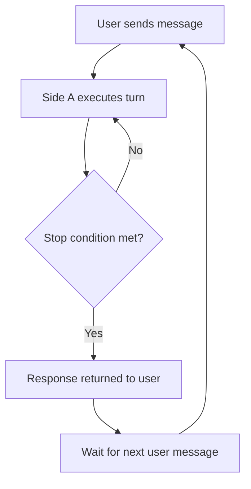
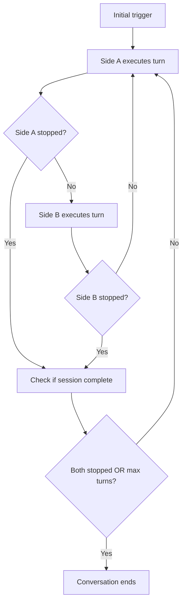

## What Are Agents?

Agents in AgentBuilder define the structure and behavior of AI-powered conversations. Think of an agent as a blueprint that determines:

- **Who's talking**: Is it AI ↔ Human or AI ↔ AI?
- **What they know**: Which prompts guide the conversation
- **What they can do**: Which tools they have access to
- **When to stop**: When turns or conversations should end

<Note>
Agents are file-based and auto-discovered. Just create a TypeScript file in `agents/agents/` and export your agent definition—no manual registration needed!
</Note>

## Quick Start

Create your first agent in `agents/agents/support_agent.ts`:

```typescript
import { defineAgent } from '@standardagents/builder';

export default defineAgent({
  name: 'support_agent',
  type: 'ai_human',
  sideA: {
    prompt: 'customer_support',
    stopOnResponse: true,
  },
});
```

This creates an agent where:
- An AI (side A) converses with a human user
- The AI uses the `customer_support` prompt
- The AI's turn ends when it sends a text response

<Check>
That's it! Your agent is now available throughout your application. The framework automatically discovers it and makes it available via the generated `AgentBuilder.Agents` type.
</Check>

## Agent Types

AgentBuilder supports two fundamental types of agents:

<AccordionGroup>
  <Accordion title="ai_human (Human-AI Conversations)" icon="message">
    The most common agent type. An AI assistant converses with a human user.

    **Perfect for:**
    - Customer support chatbots
    - Personal assistants
    - Q&A systems
    - Interactive tutorials

    **Example:**
    ```typescript
    defineAgent({
      name: 'assistant',
      type: 'ai_human',
      sideA: {
        label: 'Assistant',
        prompt: 'helpful_assistant',
        stopOnResponse: true,
      },
    });
    ```
  </Accordion>

  <Accordion title="dual_ai (AI-AI Conversations)" icon="robot">
    Two AI participants conversing with each other in turn-based fashion.

    **Perfect for:**
    - Debate simulations
    - Iterative refinement (writer ↔ critic)
    - Multi-perspective analysis
    - Evaluation loops

    **Example:**
    ```typescript
    defineAgent({
      name: 'debate_agent',
      type: 'dual_ai',
      maxSessionTurns: 20,
      sideA: {
        label: 'Pro',
        prompt: 'debate_pro',
        stopOnResponse: false,
        maxTurns: 10,
      },
      sideB: {
        label: 'Con',
        prompt: 'debate_con',
        stopOnResponse: false,
        maxTurns: 10,
      },
    });
    ```
  </Accordion>
</AccordionGroup>

## Understanding Sides

Every agent has **side A** and optionally **side B**:

### Side A (Required)

The primary AI participant. For `ai_human` agents, this is always the AI assistant.

```typescript
sideA: {
  label: 'Support Agent',       // Display name
  prompt: 'support_prompt',     // Prompt to use
  stopOnResponse: true,         // Stop when returns text
  maxTurns: 25,                 // Maximum turns allowed
}
```

### Side B (Optional)

Only required for `dual_ai` agents. For `ai_human` agents, side B represents the human user and doesn't need configuration.

```typescript
sideB: {
  label: 'Customer',
  prompt: 'customer_simulator',  // Only for dual_ai
  stopOnResponse: false,
  maxTurns: 20,
}
```

## Stop Conditions

Stop conditions control when turns and conversations end. You can combine multiple conditions:

<CardGroup cols={2}>
  <Card title="Text Response" icon="message">
    Stop when AI returns text without calling tools
    ```typescript
    stopOnResponse: true
    ```
  </Card>

  <Card title="Specific Tool" icon="wrench">
    Stop when a particular tool is called
    ```typescript
    stopTool: 'complete_checkout'
    ```
  </Card>

  <Card title="Max Turns" icon="clock">
    Stop after N turns by this side
    ```typescript
    maxTurns: 20
    ```
  </Card>

  <Card title="End Tool" icon="circle-stop">
    End entire conversation when tool is called
    ```typescript
    endConversationTool: 'close_ticket'
    ```
  </Card>
</CardGroup>

### Common Patterns

**Simple Conversation**
```typescript
sideA: {
  stopOnResponse: true,  // Stop after each response
}
```

**Multi-Step Workflow**
```typescript
sideA: {
  stopOnResponse: false,           // Don't stop on text
  stopTool: 'workflow_complete',   // Stop on specific tool
  maxTurns: 30,                    // Safety limit
}
```

**Research Loop**
```typescript
sideA: {
  stopOnResponse: false,
  endConversationTool: 'submit_research',  // End when done
  maxTurns: 50,
}
```

## Agent Handoffs

Agents can be exposed as tools, enabling specialized routing and handoffs:

```typescript
// Specialist agent
defineAgent({
  name: 'billing_specialist',
  exposeAsTool: true,
  toolDescription: 'Hand off billing and payment issues to a specialist',
  sideA: {
    prompt: 'billing_expert',
    stopOnResponse: true,
  },
});

// Router agent that can hand off
defineAgent({
  name: 'support_router',
  sideA: {
    prompt: 'router_prompt',  // Has 'billing_specialist' in tools array
    stopOnResponse: true,
  },
});
```

<Info>
When an LLM calls an agent tool, execution pauses, the specialist agent runs to completion, and the result is returned to the calling agent.
</Info>

## Common Use Cases

### Customer Support

```typescript
defineAgent({
  name: 'support_agent',
  type: 'ai_human',
  sideA: {
    label: 'Support',
    prompt: 'customer_support',
    stopOnResponse: true,
    endConversationTool: 'resolve_issue',
  },
  tags: ['support', 'customer-facing'],
});
```

### Workflow Assistant

```typescript
defineAgent({
  name: 'checkout_agent',
  type: 'ai_human',
  sideA: {
    label: 'Checkout Assistant',
    prompt: 'checkout_flow',
    stopOnResponse: false,
    stopTool: 'confirm_order',
    stopToolResponseProperty: 'orderId',
    endConversationTool: 'complete_checkout',
    maxTurns: 30,
  },
});
```

### Iterative Refinement

```typescript
defineAgent({
  name: 'content_refiner',
  type: 'dual_ai',
  maxSessionTurns: 10,
  sideA: {
    label: 'Writer',
    prompt: 'content_writer',
    maxTurns: 5,
  },
  sideB: {
    label: 'Editor',
    prompt: 'content_editor',
    maxTurns: 5,
    endConversationTool: 'approve_content',
  },
});
```

## Best Practices

<AccordionGroup>
  <Accordion title="Use Descriptive Names" icon="tag">
    Choose clear, purpose-driven names:

    ✅ **Good:** `customer_support_agent`, `billing_specialist`, `data_analyst`

    ❌ **Avoid:** `agent1`, `bot`, `helper`
  </Accordion>

  <Accordion title="Set Safety Limits" icon="shield">
    Always include `maxTurns` to prevent runaway conversations:

    ```typescript
    sideA: {
      maxTurns: 25,  // Reasonable limit for most conversations
    }
    ```

    For `dual_ai`, also set `maxSessionTurns`:
    ```typescript
    maxSessionTurns: 30,  // Total conversation limit
    ```
  </Accordion>

  <Accordion title="Choose Appropriate Stop Conditions" icon="hand">
    Match stop conditions to your use case:

    - **Conversational agents:** `stopOnResponse: true`
    - **Workflow agents:** `stopTool: 'workflow_complete'`
    - **Research agents:** `endConversationTool: 'submit_results'`
  </Accordion>

  <Accordion title="Use Labels for Clarity" icon="tag">
    Labels make logs and UI more readable:

    ```typescript
    sideA: {
      label: 'Customer Support Agent',  // Clear in logs
      prompt: 'support_prompt',
    }
    ```
  </Accordion>

  <Accordion title="Organize with Tags" icon="tags">
    Use tags for filtering and routing:

    ```typescript
    defineAgent({
      name: 'billing_support',
      tags: ['support', 'billing', 'tier-2', 'financial'],
      // ...
    });
    ```
  </Accordion>
</AccordionGroup>

## Execution Flow

### ai_human Flow



### dual_ai Flow



## Next Steps

<CardGroup cols={2}>
  <Card title="Prompts" icon="file-lines" href="/core-concepts/prompts">
    Learn how to configure the prompts that agents use
  </Card>

  <Card title="Tools" icon="wrench" href="/core-concepts/tools">
    Create custom tools that agents can call
  </Card>

  <Card title="API Reference" icon="code" href="/api-reference/agents">
    View complete configuration options and types
  </Card>

  <Card title="Examples" icon="lightbulb" href="/examples/agents">
    Explore real-world agent patterns
  </Card>
</CardGroup>
