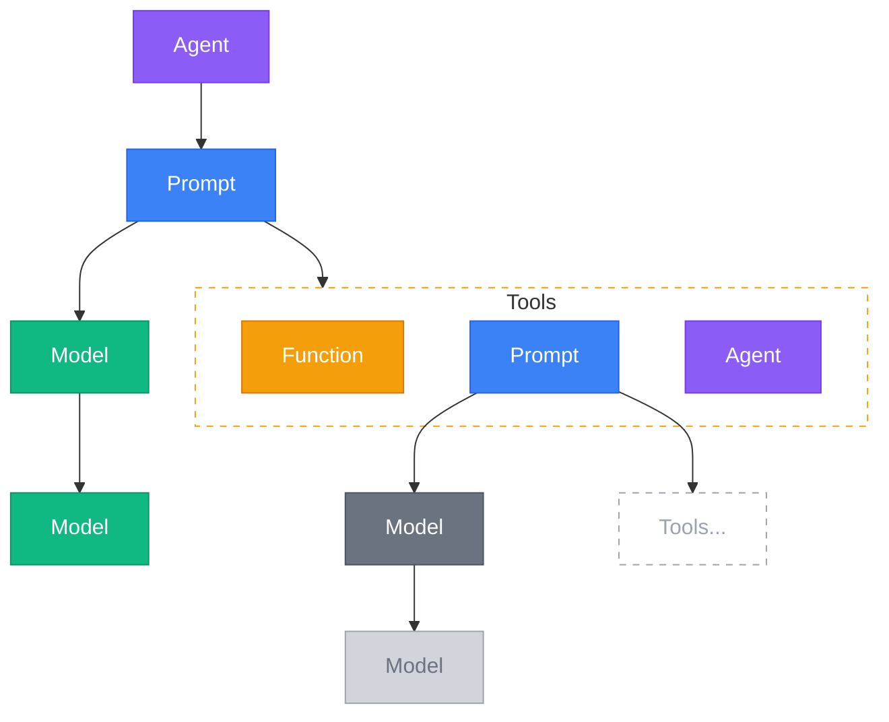

# Makeup of a Standard Agent

In order to create a Standard Agent, you define the following:

- **Models**: defines an LLM provider (currently supports OpenRouter and OpenAI) and model and fallbacks.
- **Tools**: a typescript function that can be called by an agent. This is where most business integration logic lives.
- **Prompts**: a prompt defines what the LLM will receive on any given turn of a conversation, including the system message, the available tools, the message history, and more.
- **Agents**: an agent defines the structure and behavior of a conversation, including the type of conversation (AI-Human or Dual-AI), the initial prompt to use, limits on the number of turns, and what ends one side's turns and yields the conversation to the other side.



Structurally an agent has a single prompt, a prompt can have many tools (which can be TypeScript functions, prompts, or agents) and a model, and a model can have multiple fallback models.


## Threads

To actually run an agent, you create a new thread specifying which agent you want to use. In other words you can think of a thread as an instance of an agent.

Each thread is backed by a single Cloudflare DurableObject instance (defined in your `wrangler.jsonc` file as `DurableThread`). Each thread has its own SQLite database that stores the message history of that thread, the execution state of the agent, and detailed logs of the agent's execution.

To create a thread, you can use the '+ New Thread' button in the AgentBuilder UI, or you can submit a HTTP request to the `{mountPoint}/api/threads` endpoint.

```bash
curl -X POST "https://example.com/api/threads" \
  -H "Content-Type: application/json" \
  -d '{
    "agent_id": "weather_agent",
    "tags": ["type:weather", "user:jane"]
  }'
```

If successful the response will be a JSON object containing the threadId:

```json
{
  "threadId": "123e4567-e89b-12d3-a456-426614174000",
  "agent_id": "weather_agent",
  "message": "Thread created successfully"
}
```

A thread's `id` is a cryptographically unique identifier for a given conversation. Keeping track of this id in your client code is important as it allows you to communicate directly with the thread's DurableObject instance.
<Warning>
  Depending on your use case this id may need to be treated as an authentication token. Anyone with the `threadId` has full access to the thread's data.
</Warning>


## Next Steps

<CardGroup cols={2}>
  <Card title="Core Concepts" icon="book" href="/core-concepts/agents">
    Deep dive into agents, prompts, and tools
  </Card>
  <Card title="API Reference" icon="code" href="/api-reference/introduction">
    Complete API documentation
  </Card>
  <Card title="React Package" icon="react" href="/packages/react">
    Build UIs with @standardagents/react
  </Card>
  <Card title="Best Practices" icon="star" href="/essentials/best-practices">
    Production deployment guidelines
  </Card>
</CardGroup>
